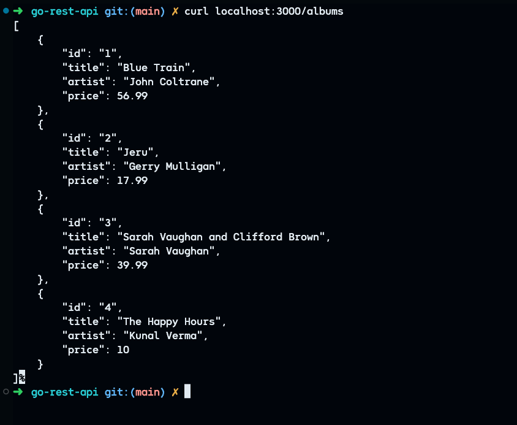
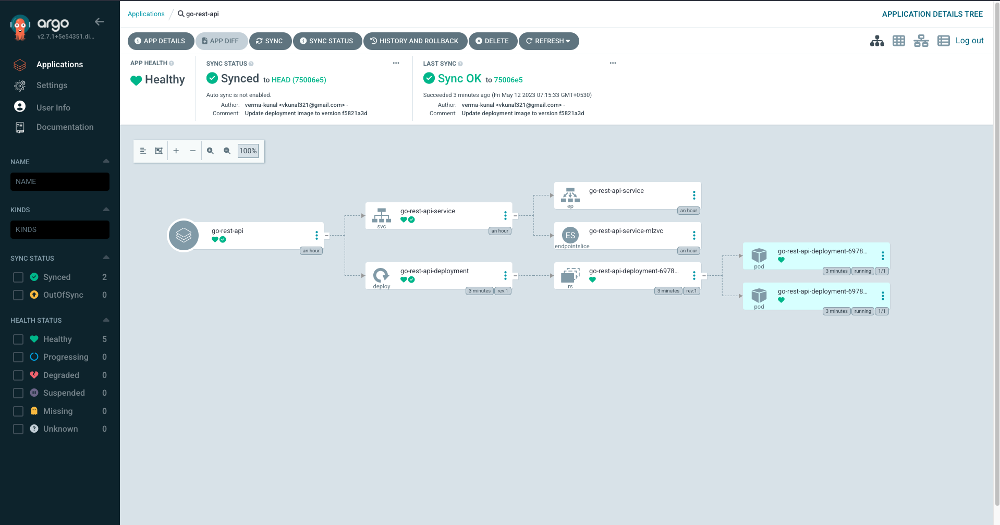

# Go REST API with GitLab CI and Argo CD


## Introduction 
This project is a simple **Go-based RESTful API** built with the [Gin Web Framework](https://gin-gonic.com/docs/quickstart/).

This project also has an implementation that demonstrates **Continuous Integration and Continuous Deployment (CI/CD)**. It provides a comprehensive example of **building**, **testing**, and **deploying** a Go application using **GitLab CI** and **Argo CD**.

## Features

* RESTful API built with **Go** and **Gin**
* Demonstrates all **CRUD operations**
* Includes simple test suite for **unit testing**
* A configured CI/CD pipeline for automated **building**, **testing**, and **deployment**
* **Static Code Analysis** using [SonarQube](https://www.sonarsource.com/products/sonarqube/)
* **GitOps enabled** - Utilizes **Argo CD** for **Kubernetes-based** deployment
* **Dockerized application** for easy deployment and scalability

## Prerequisites

Before getting started with this project, ensure you have the following dependencies installed:

- [Go (version 1.16+)](https://go.dev/doc/install)
- [Docker](https://www.docker.com/)
- [Kubernetes Cluster](https://kubernetes.io/docs/setup/) (either local or on Cloud)
- SonarQube server up and running
    - Refer the [documentation](https://docs.sonarqube.org/latest/) to configure SonarQube
- [Ngrok](https://ngrok.com/) (if you wish to run SonarQube in Docker)
- [Argo CD](https://argo-cd.readthedocs.io/en/stable/) installed

## Getting Started

### Setup the Project

To get started with this project, follow these steps:

1. **Clone the repository:**
    ```
    git clone https://gitlab.com/devops-projects6943118/ci-cd/go-rest-api.git
    ```

2. **Change into the project directory:**
    ```
    cd go-rest-api
    ```

3. **Install the dependencies:**
    ```
    go mod download
    ```
4. **Run the application:**

    - **Option 1: Run locally**
        ```
        go run main.go
        ```
    - **Option 2: Run with Docker**

        1. Build the image locally:

            ```
            docker build -t go-app .
            ```
        2. Run the docker container

            ```
            docker run -dp 3000:3000 go-app
            ```

- You can now access the app at: http://localhost:3000/albums


- To add am item to the list:

    ```
    curl http://localhost:3000/albums \
    --include \
    --header "Content-Type: application/json" \
    --request "POST" \
    --data '{"id": "5","title": "The Modern Sound of Betty Carter","artist": "Betty Carter","price": 49.99}'
    ```

## Overview of CI/CD Workflow

### GitLab CI - Continuous Integration

Refer the [**`.gitlab-ci.yml`**](https://gitlab.com/devops-projects6943118/ci-cd/go-rest-api/-/blob/main/.gitlab-ci.yml) for the full configuration.

#### Prerequisites

- Setup the following environment variables:
    - `DOCKERHUB_USER` - DockerHub Username
    - `DOCKERHUB_PASS` - DockerHub Password or Access Token
    - `SONAR_TOKEN` - SonarQube Token
    - `SSH_KNOWN_HOSTS` - SSH known hosts for GitLab (with `ssh-keyscan`)
    - `SSH_PRIVATE_KEY` - SSH private key

The CI pipeline consists of 5 stages:

1. **build** - Builds the Go binaries for Darwin, Linux and Windows
2. **test** - Run simple unit tests using [Go testing library](https://)
3. **code_quality** - Static code analysis using [SonarQube](https://)
4. **image_build** - Builds a new docker image and push to DockerHub
5. **update_k8s_manifest** - Updates the latest image tag in Kubernetes manifests

> **📍NOTE:**
> 
> The CI pipeline is configured to be triggered "on push" to the project. There are two conditions defined:
>
> 1. Trigger the CI, if the commit message ends with "-ci" keyword
    > Example: **"update:readme-ci"**
> 
> 2. Do not trigger the CI, if the commit message ends with **"-draft"** or **"-test"**

##### Steps to run SonarQube Locally (Linux)

```
apt install unzip
adduser sonarqube
wget https://binaries.sonarsource.com/Distribution/sonarqube/sonarqube-9.4.0.54424.zip
unzip *
chmod -R 755 /home/sonarqube/sonarqube-9.4.0.54424
chown -R sonarqube:sonarqube /home/sonarqube/sonarqube-9.4.0.54424
cd sonarqube-9.4.0.54424/bin/linux-x86-64/
./sonar.sh start
```

You can access the SonarQube Server on **`http://<ip-address>:9000`**

##### Steps to run SonarQube on Docker

```
docker run -d --name sonarqube -e SONAR_ES_BOOTSTRAP_CHECKS_DISABLE=true -p 9000:9000 sonarqube:latest
```

Refer the [documentation](https://docs.sonarqube.org/9.6/try-out-sonarqube/) for more information.

##### Connecting GitLab and SonarQube Server

If you are using SonarQube in Docker, you would need to expose the Sonar Server using a tool like [Ngrok](https://ngrok.com/), for GitLab to communicate with it.

Refer the [guide](https://ngrok.com/docs/using-ngrok-with/docker/) to know more about using **Ngrok** and **Docker** together.


### Argo CD - Continuous Deployment

Refer the [**`app.yml`**](https://gitlab.com/devops-projects6943118/ci-cd/go-rest-api/-/blob/main/argocd/app.yml) for full application configuration for Argo CD.

A few important points for configuring Argo CD:

1. Replace the namespace & server cluster URL with the target namespace & cluster URL for your Kubernetes cluster:

    ```
    destination:
        server: https://kubernetes.docker.internal:6443 
        namespace: go-app
    ```
2. Argo CD will automatically sync the application and deploy it based on the configuration defined:

    ```
    syncPolicy:
        automated:
          selfHeal: true
    ```
3. Monitor the deployment status and access the application once it's successfully deployed.

    

📍 To learn more about Argo CD and configure it in your cluster, refer the [documentation](https://argo-cd.readthedocs.io/en/stable/getting_started/).

## Contributing

Contributions are welcome! If you encounter any issues or have suggestions for improvements, please feel free to open an issue or submit a pull request.

## License

This project is licensed under the **MIT License**. Feel free to use and modify the code according to your needs.

## Acknowledgements

The RESTful API has been built with the help of the official Go tutorial - [**Tutorial: Developing a RESTful API with Go and Gin**](https://go.dev/doc/tutorial/web-service-gin).

The CI/CD workflow is inspired from [Abhishek Veeramalla](https://youtu.be/jNPGo6A4VHc)!